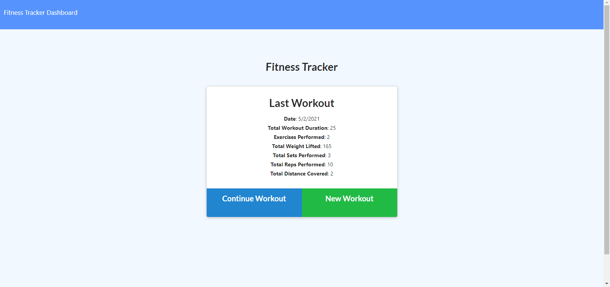
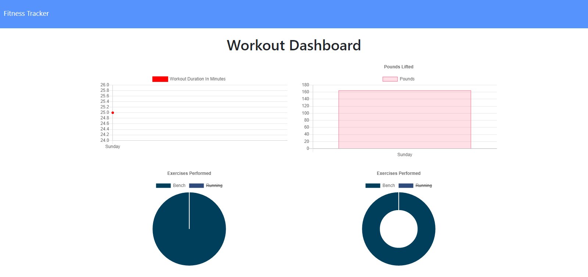

# Fitness Tracker  

  ## Table of Contents

  * [Usage](#Usage)
  * [Dependencies](#Dependencies)
  * [License](#License)
  * [Live App](#Live-App)
  * [Questions](#Questions)

## Usage
[Fitness Tracker](https://workout-tracker-g.herokuapp.com/?id=6071f16e2e13100015dca9f8)

Fitiness Tracker is designed to track your workouts that are both resistance and cardio. It summarizes the name, type, weight, sets, reps, and duration of each resistance exercise. For cardio you are able to track your distance and time. There is a detailed summary feature after a workout is completed that shows information about the completed workout.

## Dependencies
- Express
- Mongoose
- Morgan

## License 
This project is licensed under : [MIT](https://opensource.org/licenses/MIT)

## Live-App
(https://agile-sea-26265.herokuapp.com/)

### Questions?
[GitHub Repo](https://github.com/codyregis6891/tech-blog)  
Email: <codyregis6891@yahoo.com>